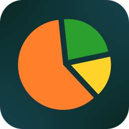
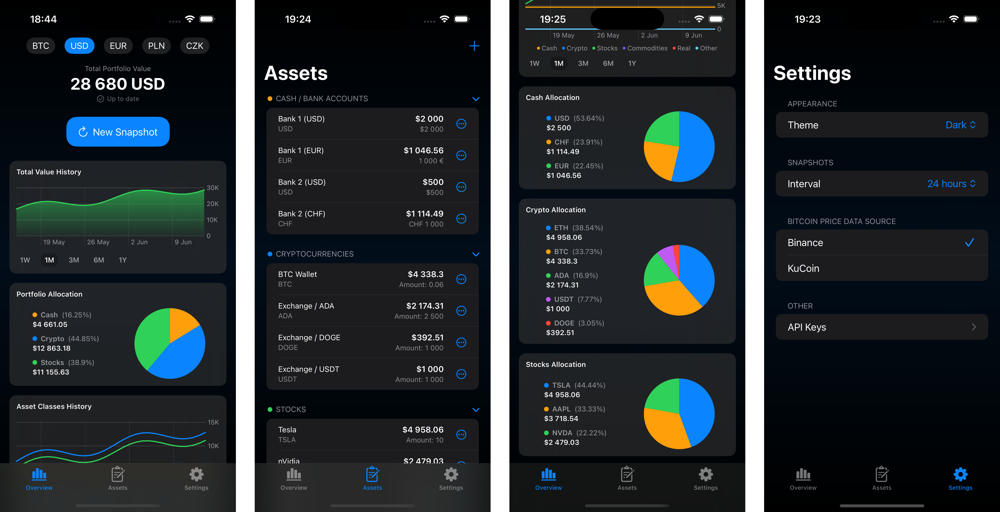
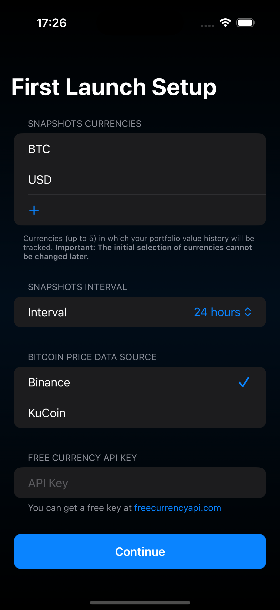

<p align="center">
  
</p>

# Total
Total is a personal finance tracking app for iOS (with planned support for macOS in the future). It serves as a tool for monitoring your financial portfolio by allowing you to create and manage lists of your cash holdings, stocks, and cryptocurrencies. The app calculates the total value of your assets and helps you track changes in value over time. It is built entirely with SwiftUI and uses SwiftData for storing assets lists and portfolio history.

The app uses public APIs and, in some cases, web scraping to gather data. Therefore, it is not suitable for publication on the App Store. This project should be treated as a template for creating a DIY personal portfolio tracking system, intended for users who have an Apple Developer account and wish to build and run the app on their own devices.

## UI



## Key features

* Calculate the total value of your portfolio.
* Track your portfolio’s history in BTC, USD and up to 3 different currencies of your choice.
* Manage lists of various types of assets including cash, stocks, and cryptocurrencies.
* All data is stored on your device (with potential future support for iCloud synchronization).
* Built-in support for APIs:
  * Free Currency API (for currency exchange rates)
  * Binance API (for cryptocurrency data)
  * KuCoin API (for cryptocurrency data)
  * Finnhub.io API (for US stock market data)
* API Keys Manager.
* Support for light and dark themes.


> [!NOTE]
> To fetch currency exchange rates, Total integrates with the [Free Currency API](https://freecurrencyapi.com). Users will need to obtain their own free API key.


## Getting Started

The [XcodeGen](https://github.com/yonaskolb/XcodeGen) tool is required to generate the Xcode project file from the `project.yml` specification.\
You can install XcodeGen via [Homebrew](https://brew.sh/):

```bash
brew install xcodegen
```

Run the following command in the root directory of the repository to generate the Xcode project:
```bash
xcodegen
```

Open the generated `Total.xcodeproj` file in Xcode. Before building the app, update the bundle identifier and development team in Xcode's build settings so that the app can be signed and installed on your device.

> [!TIP]
> For quick testing or demonstration, you can set the `USE_MOCKUP_DATA` constant in `App.swift` to `true`. This will load sample data so you can see how the app works without entering your own portfolio data.

## First Launch Setup

On first launch, the app will display a setup screen where you can:
   * Select currencies in which your portfolio value history will be tracked.
   * Enter your Free Currency API key, which you can get for free from [freecurrencyapi.com](https://freecurrencyapi.com).

:warning: **Important: The initial selection of currencies cannot be changed later.**



## Credits
Total uses the following open-source Swift packages:
* [SwiftSoup](https://github.com/scinfu/SwiftSoup) — for parsing HTML when scraping web data.
* [AlertToast](https://github.com/elai950/AlertToast) — for displaying toast messages.
* [ActivityIndicatorView](https://github.com/exyte/ActivityIndicatorView) — for showing animated loading indicators.

## License
This project is licensed under the **MIT License**. See the [LICENSE](LICENSE) file for full details.
